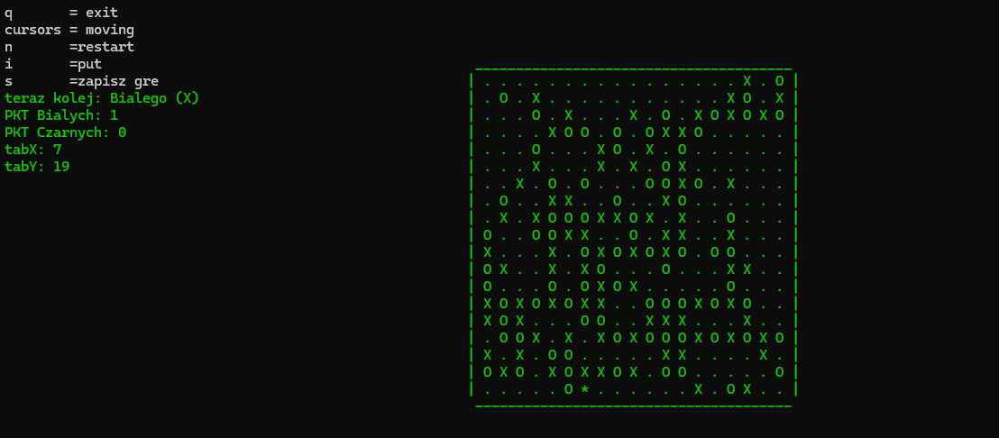

# Simple GO Game
Simple GO Game is an implementation of the popular board game Go in C++. This project allows two players to play on boards of different sizes, and supports saving and loading game states.

    

## Features

- **Board Sizes**: The game supports 9x9, 13x13, and 19x19 board sizes.
- **KO Rule**: Implementation of the KO rule, which prevents immediate repetition of a move leading to the same board state.
- **Save and Load**: Ability to save the current game state to a file and load it later.

## Game Rules
Go is a strategic board game for two players who take turns placing stones on the intersections of a grid. The objective is to control more territory on the board than the opponent and capture their stones.
